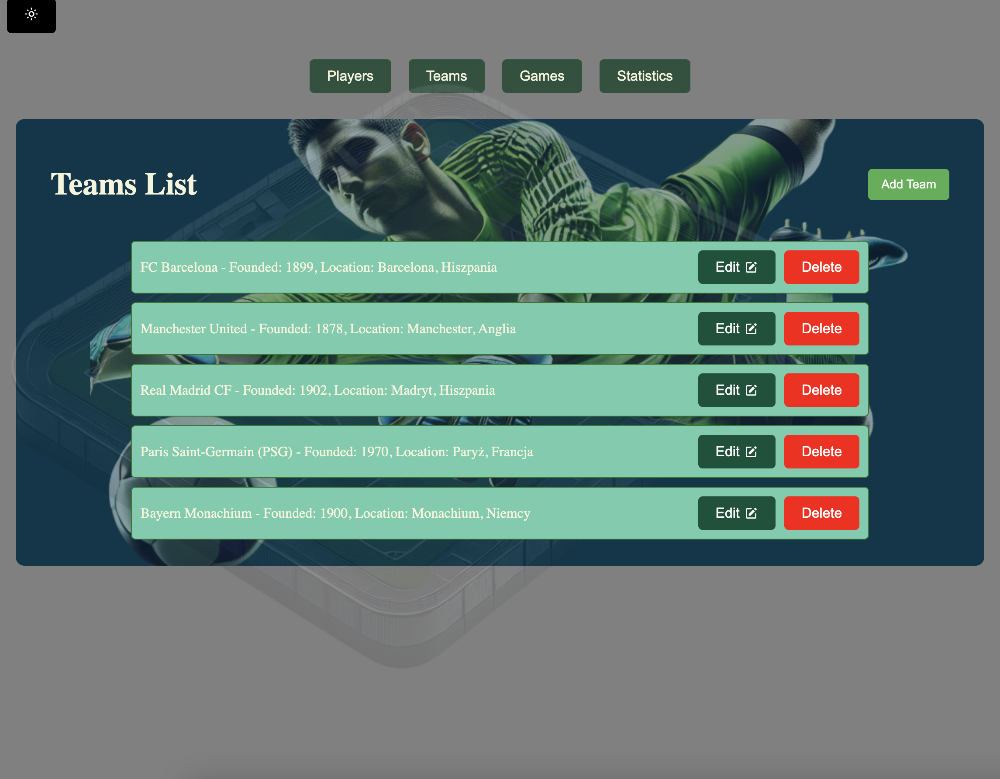

# FootballApp


## Opis projektu

FootballApp to aplikacja służąca do prezentowania podsumowań rozgrywek sportowych oraz zarządzania bazą danych zawierającą graczy, drużyny i rozgrywki.

---

## Funkcjonalności

### 1. Baza graczy

- Lista graczy.
- Dodawanie nowych graczy.
- Edycja istniejących graczy.
- Usuwanie graczy z potwierdzeniem (zabezpieczenie przed usunięciem gracza przypisanego do drużyny).

### 2. Baza drużyn

- Lista drużyn.
- Dodawanie drużyn wraz z przypisywaniem zawodników (każdy zawodnik może być przypisany tylko raz).
- Edycja danych drużyn i ich składu.
- Usuwanie drużyn z potwierdzeniem (zabezpieczenie przed usunięciem drużyn biorących udział w rozgrywkach).

### 3. Baza rozgrywek

- Lista rozgrywek.
- Dodawanie nowych rozgrywek (wprowadzenie drużyn, wyniku, daty, czasu trwania i lokalizacji).
- Edycja istniejących rozgrywek.

### 4. Statystyki

- Informacje o ostatniej rozegranej rozgrywce (drużyny, data, czas trwania, miejsce, wynik).
- Wykres przedstawiający liczbę rozgrywek w wybranym okresie (dziennie/tygodniowo/miesięcznie).
- Top 3 drużyn pod względem liczby zdobytych goli.

---

## Technologie

- **Frontend:** React z użyciem `react-query`.
- **Styling:** `styled-components` z obsługą dwóch motywów (jasny i ciemny).
- **Backend:** `json-server` jako baza danych z kolekcjami:
  - `players` (gracze).
  - `teams` (drużyny).
  - `games` (rozgrywki).
- **Walidacja:** formularze z walidacją poprawności danych.
- **Zarządzanie kodem:** Linter oraz Husky do automatycznego formatowania kodu.
- **Tryb StrictMode:** aplikacja działa poprawnie w trybie StrictMode Reacta.

---

## Wymagania systemowe

- Node.js w wersji 20 lub wyższej.
- pnpm lub yarn jako menedżer pakietów.

---

## Instalacja

1. Sklonuj repozytorium:

   ```bash
   git clone https://github.com/MariuszRudnik/Frontowcy-FootballApp/
   ```

   2.Zmień nazwę pliku .env.template na .env:

   ```bash
   mv .env.template .env
   ```

2. Przejdź do katalogu projektu:
   ```bash
   cd footballapp
   ```
3. Zainstaluj zależności:
   ```bash
   pnpm install
   ```
4. Uruchom `json-server`:
   ```bash
   json-server --watch db.json
   ```
5. Uruchom aplikację:
   ```bash
   pnpm start
   ```

---

## Przyszłe prace

- **Responsywność (RWD):**

  - Dostosowanie aplikacji do urządzeń mobilnych i tabletów.

- **Testowanie:**

  - Dodanie testów jednostkowych, integracyjnych i E2E.

- **Refaktoryzacja:**

  - Uporządkowanie kodu dla większej czytelności i łatwiejszego utrzymania.

- **Wygląd:**

  - Poprawa UI/UX oraz dodanie animacji i mikrointerakcji.

- **Funkcjonalności:**

  - Eksport danych (PDF/CSV) i filtrowanie w listach.

- **Optymalizacja:**
  - Zwiększenie wydajności ładowania danych i komponentów.

---




---

## Przydatne komendy

- Uruchomienie lintera:
  ```bash
  pnpm run lint
  ```
- Uruchomienie testów:
  ```bash
  pnpm run test
  ```

---
